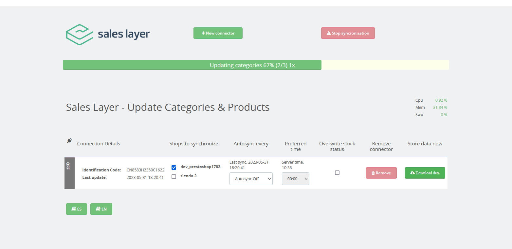
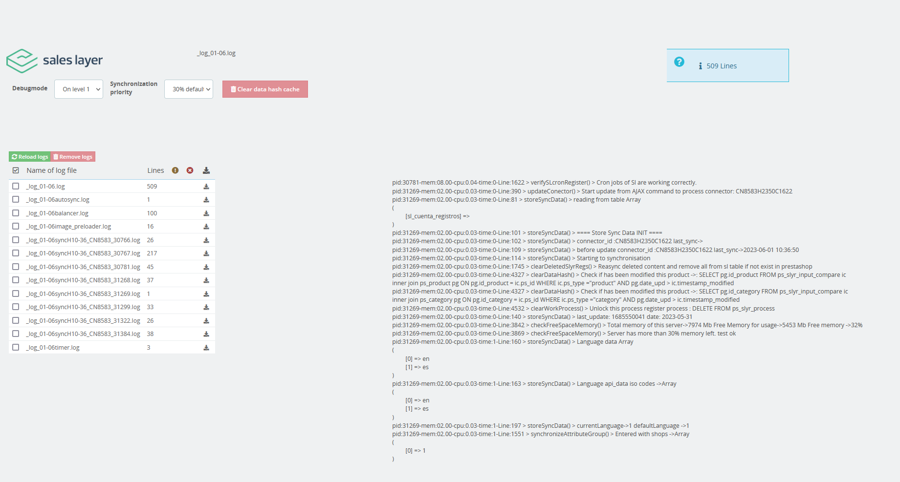

<h1><a href="https://saleslayer.com/" title="Sales layer"> Sales Layer</a> Prestashop plugin</h1>
<span>Sales Layer plugin allows you to easily synchronize your catalogue information with Prestashop.</span>

<h2>How To Start</h2>
<div>
    <h3>1. Install the plugin in Prestashop</h3>          
        <span>From Prestashops Admin panel follow these steps for installation:
            <ul>
                <li>Enter in the module installation template<br>
                IMPROVE >> Modules >> Modules & Services >> Upload a module<br>
                Attaching the zip file with the plugin.</li>                
                <li>If everything went well, the plugin is now installed. But for automatic synchronizations you need to have your cron jobs from prestashop active.</li>
                <li>Enter the template <b>How to use</b> and follow the instructions described to activate prestashop cron</li>
            </ul> 
        </span> 
</div>
<div>
    <h3>2. In the Sales Layer platform, create a Prestashop connector and assign the fields.</h3>
    <ul>
        <li>The plugin needs the connector ID code and the private key, you will find them in the connector details inside Sales Layer.</li> 
    </ul>
</div>    
<div>
    <h3>3. Add the connector credencials in Prestashop</h3>
    <ul>
        <li>Go to <b>Sales Layer</b> >> <b>Add New Connector</b>, add the connector id and secret key and press <b>Save Connector</b>.</li>
        <li>Finally, In Sales Layer >> Connectors >> The connector you created. In the <b>Autosync select</b>, choose the frequency of hours in which the synchronization must be performed, in order to synchronize products automatically.</li>
        <li>Wait a few minutes and enter the template <b>Sales Layer</b> >> <b>How to use</b> to verify that we have everything necessary working well.</li>    
    </ul><br>
    
  
  
  <br>  
</div>
<div>
    <h2>Requirements for synchronization</h2>
    <ul>
        <li>cUrl extension installed, In order to call and obtain the information from Sales Layer.</li>
        <li>Active prestashop cronjobs.</li>
        <li>Define the fields relationship in the Sales Layer Prestashop connector:
            <ul>
                <li>Most Prestashop fields are already defined in each section, extra fields for products are converted to features and extra fields for variants are converted to attributes in order to synchronize.</li> 
           </ul>
        </li>
        <li>Inside categories, products and variants there will be attributes; Sales Layer Product Identification, Sales Layer Product Company Identification and Sales Layer Format Identification, don't modify or delete these attributes or its values, otherwise, the products will be created again as new ones in the next synchronization.</li>
        <li>Inside the connector configuration you can set different values before the synchronization in the different tabs, such as:
          <ul>
            <li>Auto-synchronization and preferred hour for it.</li>
            <li>The stores where the information will be updated.</li>            
            <li>Overwrite stock status (stock will be updated only at creation of new items)</li>
          </ul>
        </li>
    </ul> 
</div>
<div>
    <h2>Diagnosis and troubleshooting</h2>
    <p>In the Diagnostics option, we have a tool list available for the diagnostic files generated by our connector.
     There are several options when executing in "debug" mode in <b>Off</b>. In this mode only files are created if any errors occur and you will only print the debug texts of an item in which an error has occurred.</p><br>
     
    
     
   <br>
   <p>In other debug options (going up from "level") more information about memory and CPU usage will appear. This information can be used for the development and solution of problems. 
     By default, however, the best option is to have it in <b>Off</b> mode and thus see only if errors occur so as not to create large files.</p><br>
     <p>The diagnostic files should be deleted automatically after 15 days. The errors that appear in the file will be marked with an icon and in red background. 
     The items with error will appear with an informative message and the identifying reference of Sales Layer to be able to go to review the information if it is required. An example of a message would be:</p>
                 
 ```html          
                                                ## Error. Creating category  ID: 91
 ```
 
  <i>With this message we know that it is a category and that its reference in Sales Layer is "91".</i><br>      
  <p>In case the error does not have an identifying reference it is possible that it has happened somewhere in the middle of the code and, in this case, we can identify it in the general log file that begins with:</p>          

```html 
                                                _debbug_log_saleslayer_sync_data_
```

<p>... followed with the date of the day of what happened.
 In the file we can find more information about the element in which the problem has occurred (by clicking on the error icon) and we can jump from one error to another and navigate between the errors (if more than one has occurred).</p>
<p>The errors that could be found before the synchronization of an item, most likely relate to this fact. With this we can identify if it is a category or another element, and what concrete reference you have to review it in Sales Layer.</p>                 
</div>
<div>
<h2>Development or Customization</h2>
<p>For developers who need to customize the plugin or make corrections in the code they can use the diagnostic tool as well as unlock the button to remove everything from prestashop. 
This button will help you to eliminate in bulk all the categories, products and variants to synchronize everything from an empty shop, it is made only for development therefore it should be used in a test server and with caution. To unblock this botton you can edit the saleslayerimport.php file and change the variable value:</p>

```php 
                                     public      $i_am_a_developer                    = false;
```

<p>a true value to unlock the button.</p>
</div>
<div>
<h2>Creation of Custom Fields</h2>

<p>To create custom fields we can use the <b>customizable</b> field in the configuration of the connector in the Sales Layer cloud. The plugin recognizes internal commands that we can add after he value we set as the field name, this appears behind the field "YOUR TEXT FOR FIELD:file". This Command makes it so that the field is created as a required one, and so the client has to fill in the desired field "YOUR TEXT FOR FIELD:required" . The fields can be created as comma separated text, attribute lists, or completed with a formula such as comma separated text. If we want to send it in several languages we must choose the text field.</p>
 <h5>Example:</h5>
<b>My Custom Field:file, My other custom field:required, My field for images:file:required</b>
<h5>this will create fields in prestashop on the product:</h5>

<ul>
<li><b>My Custom Field</b> - Field to upload images.</li>
<li><b>My other custom field</b> - Text field with mandatory settings to be filled in by the customer.</li>
<li><b>My field for images</b> - Field to upload mandatory images to be filled in when sending the order.</li>
</ul>
</div>
<div>
<h2>Custom colors</h2>
<p>The plugin contains, from version 1.4.3, a folder called colors which contains a small database of colors that it recognizes for each language. This folder is used to recognize attributes of non-existent colors in prestashop for variants. This means that if Sales layer comes with a light green variant in Spanish, the plugin will try to find the file es.txt, remove the accents and spaces, and then look for the color light green and assigns it the color value #90ee90 that is predefined in the file. These files can be customized for your needs. The reason for this is that each company uses different names and different color maps in several languages ​to recognize colors. This allows you to always have your file and with each update simply copy and paste your colored files into the plugin. It is enough to have a file in a language that we are going to use to recognize colors and assign them the first time the attribute was created.</p>

<b>Another way to send colors is to send the color as text so:</b>
 <b>light green:#90ee90</b> <p>The plugin accepts everything before "<b>:#</b>" as a name and everything after ":" as color "<b>#90ee90</b>".</p>
</div>


